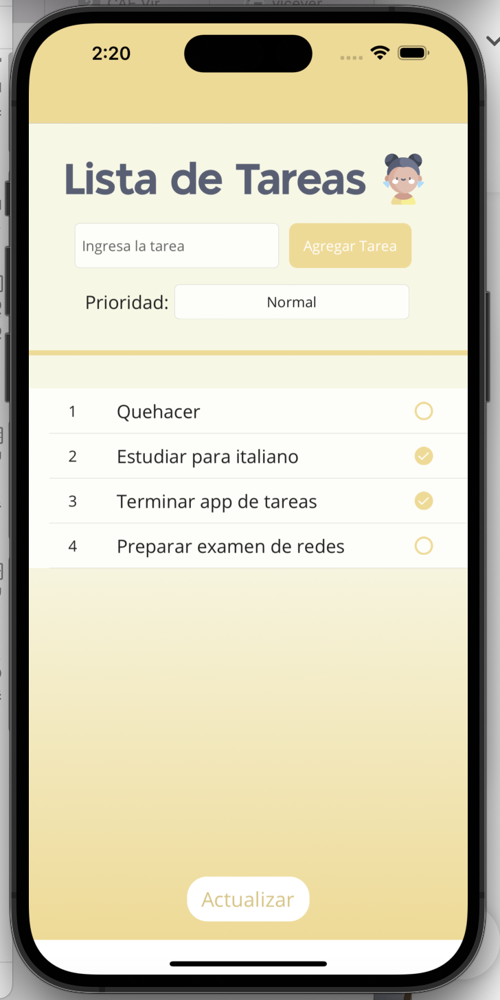
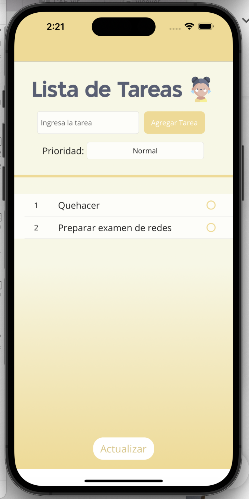

# Lista De Tareas
Aplicación de lista de tareas con .NET MAUI, desarrollo móvil

### Capturas de pantalla:

Ingresa una tarea y selecciona la importancia de esta (normal, importante, urgente)

Tarea agregada de acuerdo a su prioirdad seleccionada

Selecciona las tareas completadas y clickea el botón para eliminarlas

